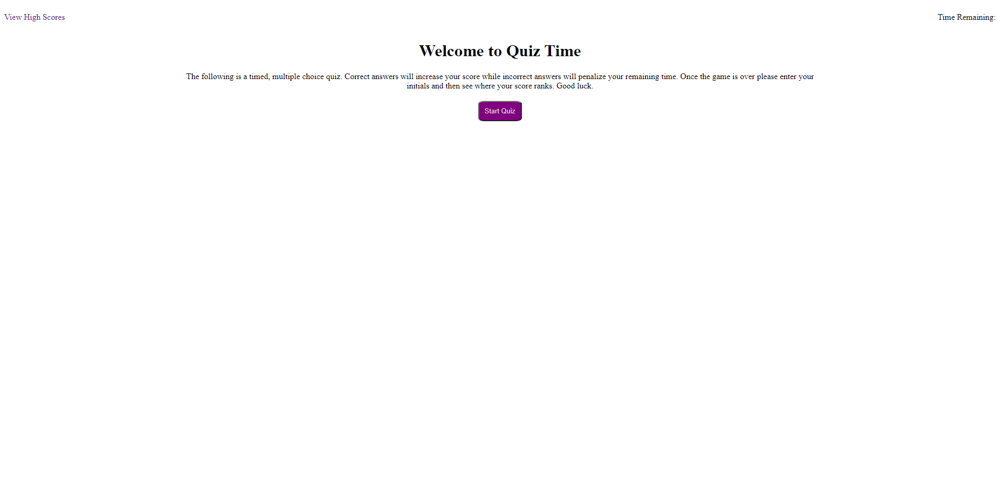
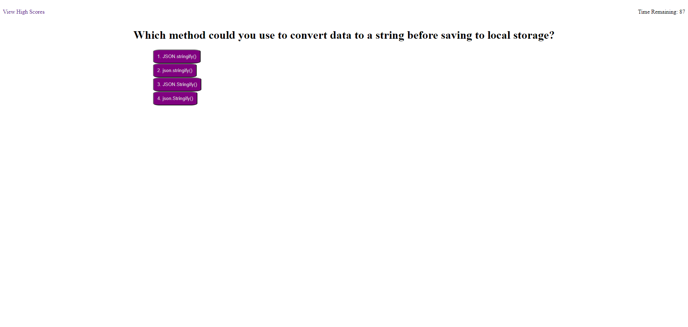
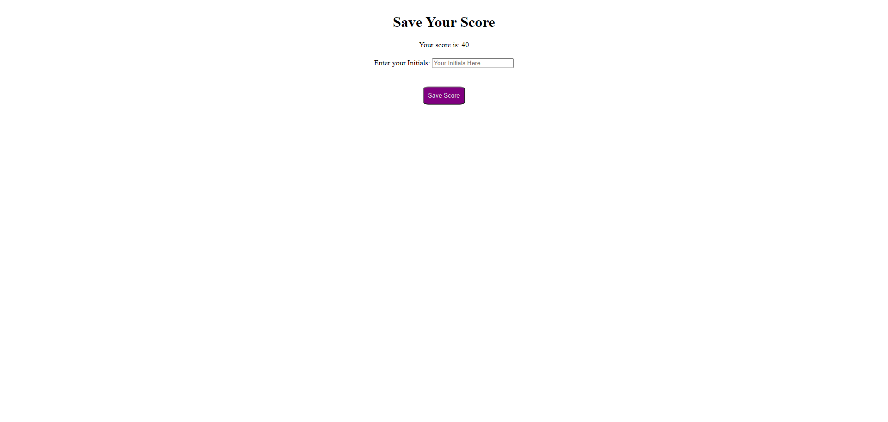
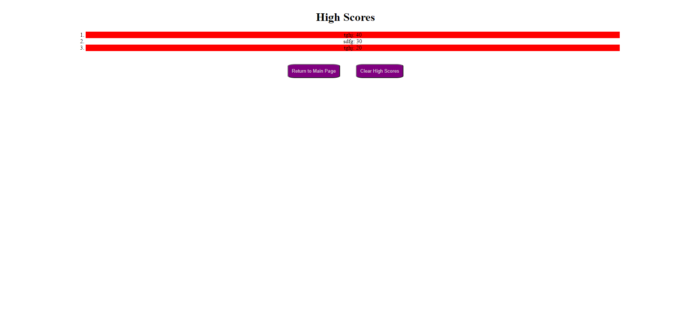

# Basic Quiz Code

## Purpose
Create a basic quiz webpage that not only scores a quiz but saves the scores and displays a high score page utilizing local storage. 

## Built With
* HTML
* CSS
* Java Script

## Contents
3 html files, 3 JS files (one for each html), one shared CSS page, 4 screenshots. All contents besides this README and index.html is within an Assets folder.

## Website
https://dragoonkite.github.io/quiz-time/

## Contribution
Made with ❤️ by DragoonKite

### ©️2020 Frank DePaolo